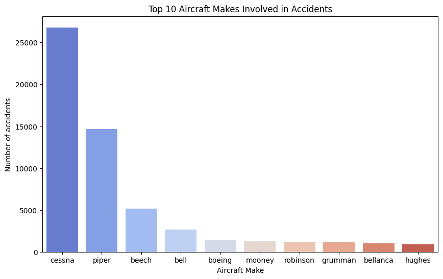
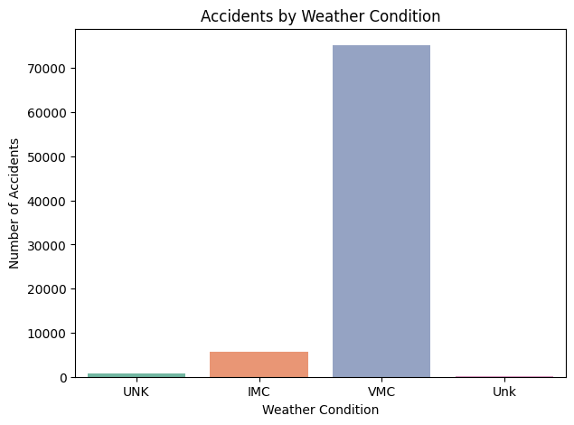
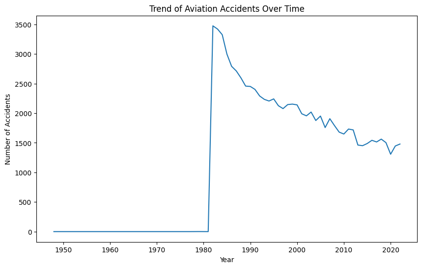

# Phase_1_Project
This is my first project as a Data Scientist/ Analyst at Moringa School

###### Dashboard link (https://public.tableau.com/views/AviationAccidentRiskAnalysis/AviationaccidentanalysisDashboard?:language=en-US&publish=yes&:sid=&:redirect=auth&:display_count=n&:origin=viz_share_link)

### Overview of the Data.
This is a Risk assessment analysis.

##### The business problem is:
A company is expanding into new industries to diversify its portfolio. Specifically, they are interested in purchasing and operating airplanes for commercial and private enterprises but do not know anything about the potential risks of aircraft. When starting this new business endeavor, you are charged with determining which aircraft are the lowest risk for the company. You must then translate your findings into actionable insights that the head of the new aviation division can use to help decide which aircraft to purchase.

##### Business Understanding
I needed to assess the risk analysis of the aircraft, and which aircraft poses the least risks.
###### The business questions that I am going to use are:

1. What aircraft make is involved in the highest number of accidents?

  Understanding which aircraft manufacturers have higher accident rates can help aviation companies assess risks and maintenance needs or examine design factors that contribute to safety   issues.
  
2. How does weather impact the occurrence of accidents?

  Identifying trends between specific weather conditions (e.g., clear, rainy, foggy) and accident frequency can help airlines and regulatory bodies improve flight operation protocols in    adverse weather.
  
3. What phases of flight are most prone to accidents?

  Knowing which part of a flight (e.g., takeoff, cruise, landing) is riskiest can inform pilot training, safety guidelines, and technology improvements to minimize risks.
  
4. Are there geographical locations (countries/airports) where accidents occur more frequently?
   
  Identifying hotspots for accidents can prompt regulatory bodies to investigate regional factors like airport infrastructure, air traffic control efficiency, and terrain challenges.

5. What is the trend of fatal accidents over time?

  Tracking the trend of fatal accidents could indicate improvements or worsening in aviation safety, helping authorities to assess the effectiveness of safety measures and regulations      over time.

  ### Data Understanding and Analysis.
  #### Source of Data
This data appears to be from an aviation accident and incident reporting database, which typically captures information from agencies like the National Transportation Safety Board (NTSB) or similar organizations. The columns suggest it includes detailed records of aviation incidents, including location, type of accident, weather conditions, severity, and aircraft details. This type of data helps aviation authorities and airlines track, investigate, and prevent accidents and incidents.

#### Description of data
##### DATAFRAME STRUCTURE.
The DataFrame has 88889 rows and 31 columns

There are two types of data used. Float64 and object.

Float64, which has been used on 5 columns, is used for numerical data

Object, which has been used on 26 columns, is used for categorical data.

##### In the column descriptions and explanations, we have:
Event.Id: A unique identifier for each accident.

Investigation.Type: The type of investigation conducted (e.g., accident, incident).

Accident.Number: A number assigned to the accident.

Event.Date: The date of the accident.

Location: The location of the accident.

Country: The country where the accident occurred.

Latitude and Longitude: The geographic coordinates of the accident.

Airport.Code and Airport.Name: The airport involved in the accident.

Injury.Severity: The severity of injuries (e.g., Fatal, Serious, Minor).

Aircraft.damage: The extent of damage to the aircraft.

Aircraft.Category: The category of the aircraft (e.g., airplane, helicopter).

Registration.Number: The registration number of the aircraft.

Make and Model: The manufacturer and model of the aircraft.

Amateur.Built: Whether the aircraft was built by an amateur.

Number.of.Engines: The number of engines on the aircraft.

Engine.Type: The type of engines on the aircraft.

FAR.Description: A description of the Federal Aviation Regulations (FAR) involved.

Schedule: Whether the flight was scheduled or unscheduled.

Purpose.of.flight: The purpose of the flight (e.g., commercial, private).

Air.carrier: The airline operating the flight.

Total.Fatal.Injuries, Total.Serious.Injuries, Total.Minor.Injuries, Total.Uninjured: The number of injuries of different severities and the number of people who were not injured.

Weather.Condition: The weather conditions at the time of the accident.

Broad.phase.of.flight: The phase of flight (e.g., takeoff, landing, cruise).

Report.Status: The status of the investigation report.

Publication.Date: The date the report was published.

The info above also provides us with the missing values.
Some columns have missing values, indicated by the "Non-Null Count" being less than the total number of rows. For example, "Location" has 52 missing values

Because of the missing values, I had to clean the dataset. I also changed the Event.Date column into datetime datatype to help with clear Visualizations when dealing with time. I also  checked for outliers and dealt with them.

#### Visualizations
1. ###### The first visualization is a histogram of the top 10 Aircrafts per number of accidents.

This is a histogram of the top 10 aircrafts according to mode, and the number of accidents each has had.

From the graph, we can deduce the following.

Key Observations:

##### Cessna Dominates:
Cessna is by far the most frequently involved aircraft make, with a significantly higher number of accidents compared to the others.

##### Piper and Beech Follow:

Piper and Beech also have notably high accident counts, ranking second and third respectively.

##### Bell and Boeing: 

Bell and Boeing appear to be involved in a moderate number of accidents.

##### Robinson, Grumman, Bellanca, Mooney, and Hughes: 

These aircraft makes have relatively lower accident counts, forming the lower end of the top 10 list.

#### Potential Outcomes:

##### Popularity and Production: 

The high frequency of Cessna, Piper, and Beech accidents might be partially attributed to their popularity and larger production volumes.

##### Aircraft Design or Usage: 

Factors such as aircraft design intended use (e.g., general aviation, commercial), or operating conditions could also influence accident rates.

##### Data Limitations: 

It's important to note that this analysis is based on the top 10 aircraft makes and doesn't account for less common makes or models.

2. ###### The second visualization is of various weather conditions and the number of accidents that occured  during that weather condition.

From the histogram above, we can deduce the following:
Key Observations:

##### VMC Dominates: 

The "VMC" (Visual Meteorological Conditions) category has the highest number of accidents by a significant margin, indicating that the majority of accidents occur in clear weather conditions.

##### IMC and UNK: 

The "IMC" (Instrument Meteorological Conditions) and "UNK" (Unknown) categories have considerably lower accident counts, suggesting that while weather can be a contributing factor, it's not the primary cause in most cases.

#### Potential Outcomes/ views:

##### Pilot Error: 

The dominance of VMC accidents might suggest that pilot error is a more significant factor than weather conditions, especially in clear weather when visibility is high.

##### Maintenance and Inspection: 

Ensuring proper maintenance and inspections of aircraft can help prevent accidents, regardless of weather conditions.

##### Data Limitations: 

The "UNK" category indicates that the weather conditions for a portion of accidents were not recorded or determined, which could limit our understanding of the role of weather in aviation safety.

3. The third visualization is of the trend of accidents over time.
   

   From the line graph above, we can deduce the following:
   Key Observations:

##### Significant Decrease: 

There's a clear downward trend in the number of aviation accidents over time, suggesting that safety measures and advancements in technology have been effective in reducing the occurrence of accidents.

##### Sharp Drop in the 1970s: 

The most dramatic decrease appears to have occurred in the 1970s, possibly due to advancements in aircraft design, safety regulations, and pilot training.

##### Relatively Stable Recent Years: 

While there was a slight upward trend in the late 2000s, the overall number of accidents has remained relatively stable in recent years.

#### Potential Implications:

##### Safety Improvements: 

The ongoing downward trend indicates that the aviation industry has made significant strides in improving safety.

##### Regulatory Impact: 

Safety regulations, such as those implemented by the International Civil Aviation Organization (ICAO), have played a crucial role in reducing accidents.

##### Technological Advancements: 

Advancements in aircraft design, avionics, and air traffic management systems have also contributed to improved safety.

##### Data Limitations: 

It's important to note that this analysis is based on the overall trend and doesn't account for factors like accident severity, regional variations, or specific causes of accidents.
